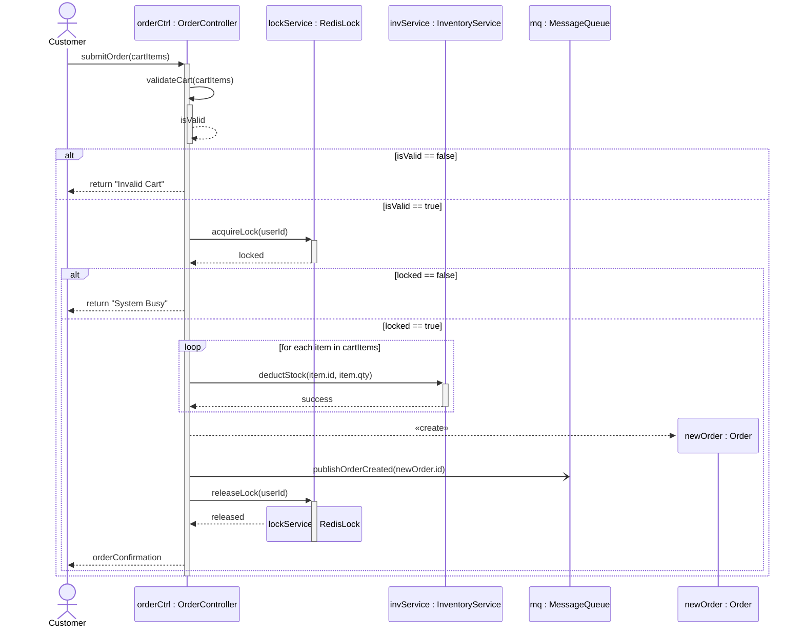

```mermaid
sequenceDiagram
    actor Customer
    participant orderCtrl as orderCtrl : OrderController
    participant lockService as lockService : RedisLock
    participant invService as invService : InventoryService
    participant mq as mq : MessageQueue

    Customer->>+orderCtrl: submitOrder(cartItems)
    
    %% 自调用校验
    orderCtrl->>+orderCtrl: validateCart(cartItems)
    orderCtrl-->>-orderCtrl: isValid

    alt isValid == false
        orderCtrl-->>Customer: return "Invalid Cart"
    else isValid == true
        orderCtrl->>+lockService: acquireLock(userId)
        lockService-->>-orderCtrl: locked

        alt locked == false
            orderCtrl-->>Customer: return "System Busy"
        else locked == true
            loop for each item in cartItems
                orderCtrl->>+invService: deductStock(item.id, item.qty)
                invService-->>-orderCtrl: success
            end

            %% 动态创建订单对象
            create participant newOrder as newOrder : Order
            orderCtrl-->>newOrder: «create»

            %% 异步消息通知 (开放箭头 -))
            orderCtrl-)mq: publishOrderCreated(newOrder.id)

            %% 释放锁并销毁生命线
            orderCtrl->>+lockService: releaseLock(userId)
            destroy lockService
            lockService-->>-orderCtrl: released

            orderCtrl-->>Customer: orderConfirmation
        end
    end
    deactivate orderCtrl
```
