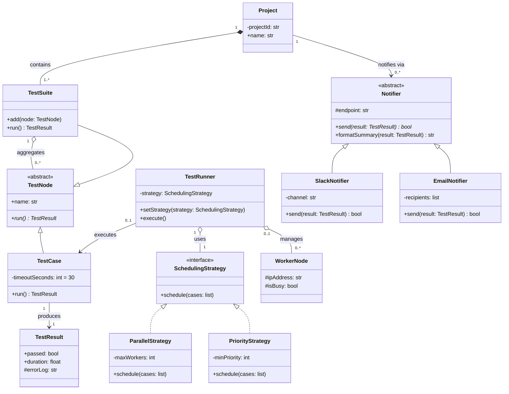

```mermaid
classDiagram
    class Project {
        -projectId: str
        +name: str
    }
    class TestNode {
        <<abstract>>
        +name: str
        +run()* TestResult
    }
    class TestSuite {
        +add(node: TestNode)
        +run() TestResult
    }
    class TestCase {
        -timeoutSeconds: int = 30
        +run() TestResult
    }
    class TestResult {
        +passed: bool
        +duration: float
        #errorLog: str
    }
    class TestRunner {
        -strategy: SchedulingStrategy
        +setStrategy(strategy: SchedulingStrategy)
        +execute()
    }
    class SchedulingStrategy {
        <<interface>>
        +schedule(cases: list)
    }
    class ParallelStrategy {
        -maxWorkers: int
        +schedule(cases: list)
    }
    class PriorityStrategy {
        -minPriority: int
        +schedule(cases: list)
    }
    class WorkerNode {
        #ipAddress: str
        #isBusy: bool
    }
    class Notifier {
        <<abstract>>
        #endpoint: str
        +send(result: TestResult)* bool
        +formatSummary(result: TestResult) str
    }
    class SlackNotifier {
        -channel: str
        +send(result: TestResult) bool
    }
    class EmailNotifier {
        -recipients: list
        +send(result: TestResult) bool
    }

    Project "1" *-- "1..*" TestSuite : contains
    TestNode <|-- TestSuite
    TestNode <|-- TestCase
    TestSuite "1" o-- "0..*" TestNode : aggregates

    TestRunner "0..1" --> "0..*" TestCase : executes
    TestRunner "1" o-- "1" SchedulingStrategy : uses
    SchedulingStrategy <|.. ParallelStrategy
    SchedulingStrategy <|.. PriorityStrategy
    TestRunner "0..1" o-- "0..*" WorkerNode : manages

    TestCase "1" --> "1" TestResult : produces
    Project "1" --> "0..*" Notifier : notifies via
    Notifier <|-- SlackNotifier
    Notifier <|-- EmailNotifier
```
