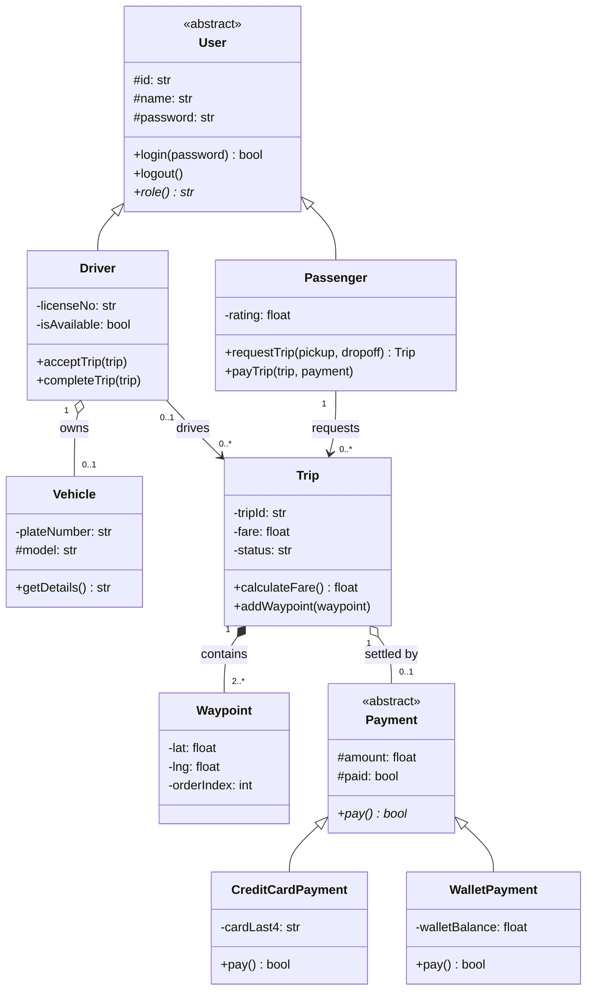

# diagrams

```mermaid
classDiagram
    class User {
        <<abstract>>
        #id: str
        #name: str
        #password: str
        +login(password) bool
        +logout()
        +role()* str
    }
    class Passenger {
        -rating: float
        +requestTrip(pickup, dropoff) Trip
        +payTrip(trip, payment)
    }
    class Driver {
        -licenseNo: str
        -isAvailable: bool
        +acceptTrip(trip)
        +completeTrip(trip)
    }
    class Vehicle {
        -plateNumber: str
        #model: str
        +getDetails() str
    }
    class Trip {
        -tripId: str
        -fare: float
        -status: str
        +calculateFare() float
        +addWaypoint(waypoint)
    }
    class Waypoint {
        -lat: float
        -lng: float
        -orderIndex: int
    }
    class Payment {
        <<abstract>>
        #amount: float
        #paid: bool
        +pay()* bool
    }
    class CreditCardPayment {
        -cardLast4: str
        +pay() bool
    }
    class WalletPayment {
        -walletBalance: float
        +pay() bool
    }

    User <|-- Passenger
    User <|-- Driver
    Driver "1" o-- "0..1" Vehicle : owns
    Passenger "1" --> "0..*" Trip : requests
    Driver "0..1" --> "0..*" Trip : drives
    Trip "1" *-- "2..*" Waypoint : contains
    Trip "1" o-- "0..1" Payment : settled by
    Payment <|-- CreditCardPayment
    Payment <|-- WalletPayment
```
